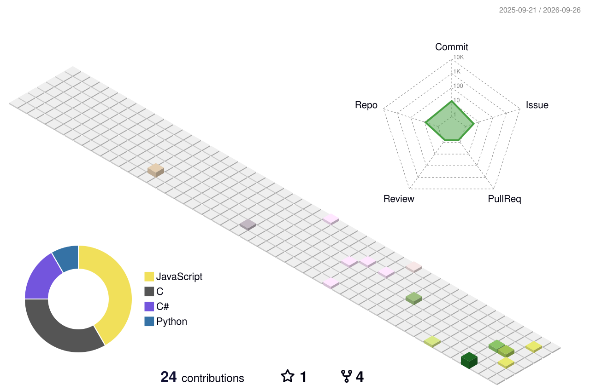

  

  

   

  
  

## 🧭 关于我

🔧 折腾 Web、嵌入式与各种好玩的小工具 &nbsp;·&nbsp; 🌱 正在学习前端工程化 &nbsp;·&nbsp; 💬 找我：GitHub Issue

  <code></code>
  <code></code>
  <code></code>
  <code></code>
  <code></code>
  <code></code>
  <code></code>
  <code></code>
  <code></code>
  <code></code>
  <code></code>

## 📊 GitHub 统计

## 🐍 贪吃蛇

<picture>
  <source media="(prefers-color-scheme: dark)" srcset="https://raw.githubusercontent.com/Hush-xv/Hush-xv/output/github-contribution-grid-snake-dark.svg" />
  
</picture>

## 🏙 3D 贡献城市

## 🛠 常用技术

## 💬 今日一句

