<div align="center">
  

  <a href="https://github.com/Hush-xv"></a>

  <br/>

   &nbsp; [](https://github.com/Hush-xv) &nbsp; [](https://github.com/Hush-xv)
</div>

<div align="center">
<h1>Hi，我是 Hush-xv 👋</h1>
<p><b>🔧 Builder · 🌱 Learner · ✦ 记录技术与生活</b></p>
</div>

## 💻 终端

```bash
$ whoami
Hush-xv — Web / 嵌入式 / 工具折腾者

$ cat now.txt
🌱 learning : 前端工程化
🚀 building : GitHub 个人主页
📦 shipping : 顺手把一切工具化

$ uptime
curiosity ██████████████████████████ 100%
```

## 📊 GitHub 统计

<div align="center">
<picture>
  <source media="(prefers-color-scheme: dark)" srcset="assets/metrics.svg" />
  
</picture>
</div>

<div align="center">
<picture>
  <source media="(prefers-color-scheme: dark)" srcset="assets/streak.svg" />
  
</picture>
</div>

## 🐍 贪吃蛇

<div align="center">
<picture>
  <source media="(prefers-color-scheme: dark)" srcset="https://raw.githubusercontent.com/Hush-xv/Hush-xv/output/github-contribution-grid-snake-dark.svg" />
  
</picture>
</div>

## 🏙 3D 贡献城市

<div align="center">
<picture>
  <source media="(prefers-color-scheme: dark)" srcset="profile-3d-contrib/profile-night-rainbow.svg" />
  
</picture>
</div>

## 🛠 常用技术

<div align="center">
  <a href="https://astro.build"></a>
  <a href="https://www.typescriptlang.org"></a>
  <a href="https://developer.mozilla.org/docs/Web/JavaScript"></a>
  <a href="https://developer.mozilla.org/docs/Web/HTML"></a>
  <a href="https://developer.mozilla.org/docs/Web/CSS"></a>
  <a href="https://git-scm.com"></a>
  <a href="https://github.com"></a>
  <a href="https://www.markdownguide.org"></a>
  <a href="https://code.visualstudio.com"></a>
  <a href="https://nodejs.org"></a>
  <a href="https://www.gnu.org/software/bash"></a>
  <a href="https://www.kernel.org"></a>
</div>

## 💬 今日一句

<div align="center">

</div>

<div align="center">

</div>
